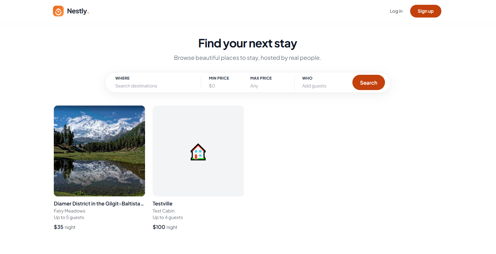
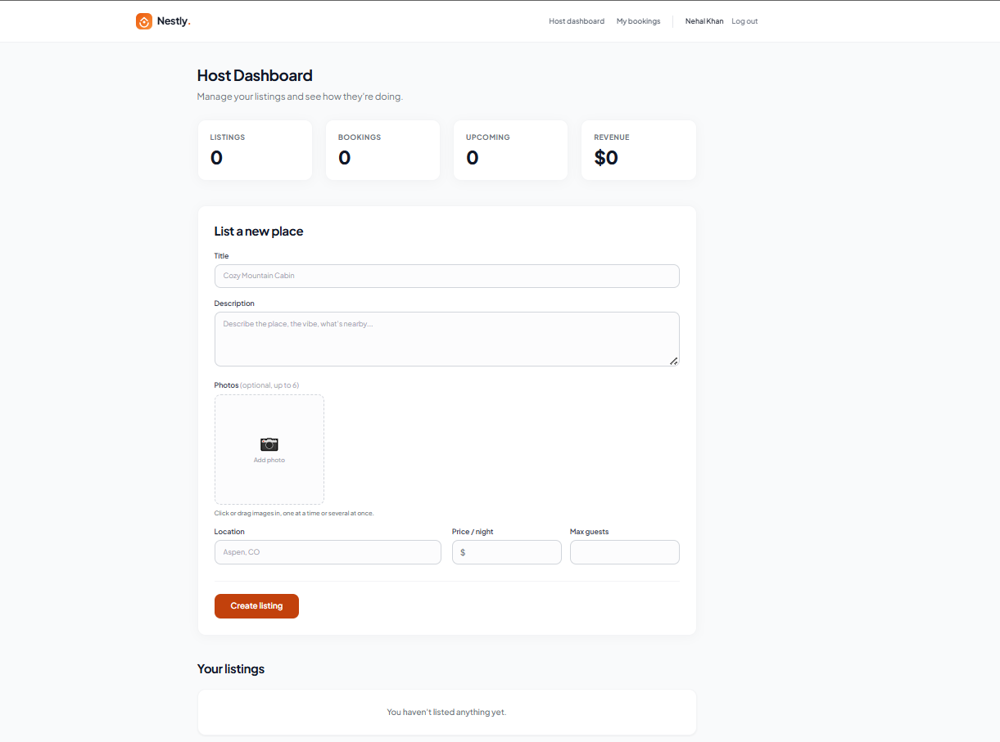
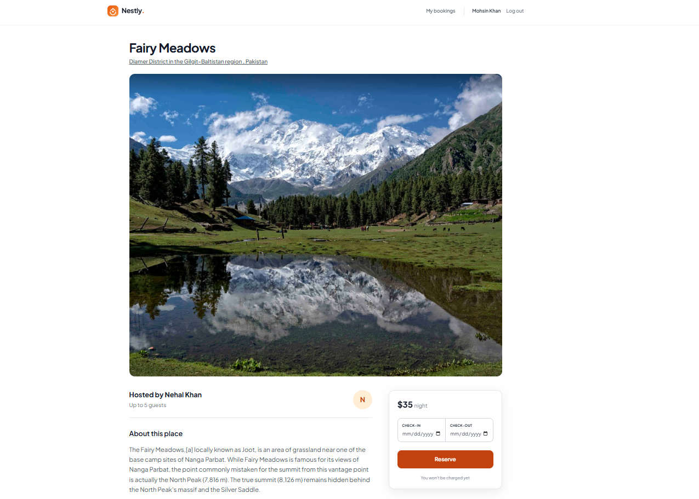
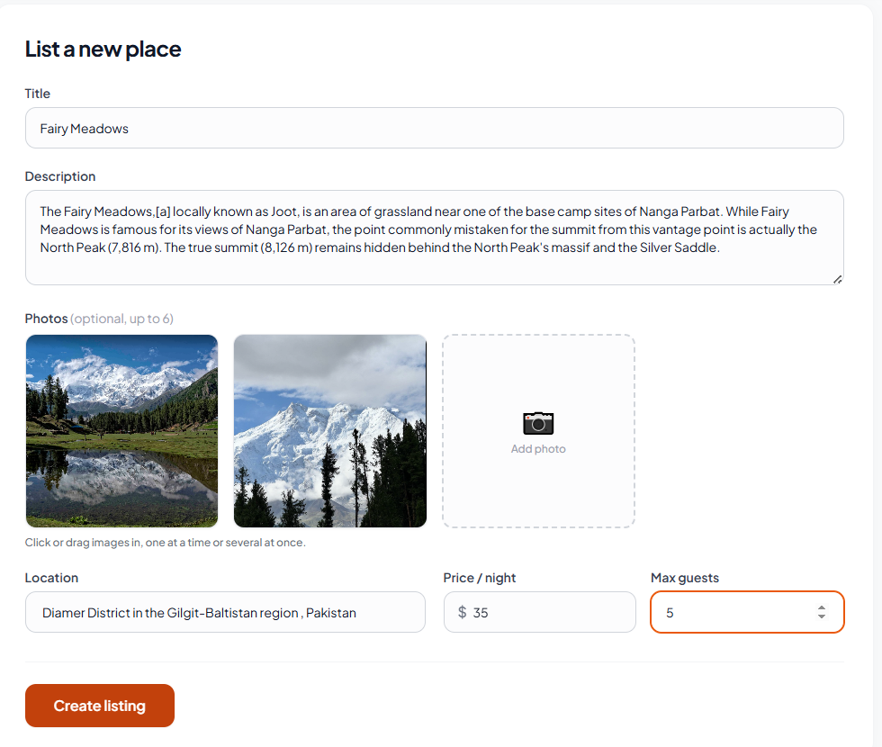

# Nestly — Frontend 🏡

🔗 **Live app:** https://nestly-booking-app.vercel.app/
🔗 **Backend repo:** https://github.com/muzzammilahmed18/nestly-backend

A full-stack property booking marketplace — hosts list places to stay, guests search, filter, and book them, with real double-booking prevention, role-based permissions, photo uploads, and a data dashboard. Built as a capstone project across a full-stack internship.

## The problem it solves
Short-term stay booking is fundamentally a two-sided marketplace problem: hosts need an easy way to list a space and manage who's staying when, without ever double-booking the same dates to two different guests; guests need to search, filter, and book with confidence that their dates are actually secured. Nestly solves both sides with one shared, relational data model.

## Architecture overview
```text
┌──────────────────┐        HTTPS/JSON         ┌───────────────────┐
│   React (Vite)   │ ────────────────────────► │  Express API      │
│   on Vercel      │ ◄──────────────────────── │  on Render        │
│                  │      JWT in headers       │                   │
└──────────────────┘                           └───────────────────┘
                                                         │
                                                Prisma ORM
                                                         │
                                                         ▼
                                               PostgreSQL (Neon)
                                       User ──< Listing ──< Booking
```
* **Frontend:** React + Vite, deployed as a static build on Vercel.
* **Backend:** Node + Express on Render — a single service handling auth, listings CRUD, bookings, and admin moderation.
* **Database:** PostgreSQL (hosted on Neon), accessed through Prisma — a genuinely relational schema, not just flat tables: one Host has many Listings, one Listing has many Bookings, one Guest has many Bookings.
* **Auth:** JWT issued on signup/login, carrying the user's role (`GUEST` / `HOST` / `ADMIN`), stored in localStorage, sent as a Bearer token on every protected request.
* **Photo uploads:** The browser uploads directly to Cloudinary (an unsigned upload preset), not through the backend — only the resulting URL ever touches the Express API or the database.
* **State:** `AuthContext` and `ToastContext` via React Context — no external state library needed at this size.

## 📸 App Screenshots

<p align="center">
  
  
</p>
<p align="center">
  
  
</p>

## Roles, concretely:
* **GUEST** — browses, searches, books, manages their own bookings.
* **HOST** — everything a Guest can view, plus creating/editing/deleting their own listings and seeing bookings + revenue across them.
* **ADMIN** — platform-wide view: every user, every listing, can remove any listing regardless of who owns it. Never created through signup — only assigned manually, directly in the database.

## The hardest problem: preventing double-bookings
Two guests trying to book overlapping dates on the same listing is a real race condition — if the "is this available?" check and the actual booking creation happen as two separate steps, two requests arriving milliseconds apart could both pass the check before either booking exists yet, and both would succeed. 

The backend wraps the overlap check and the booking creation inside a single Prisma `$transaction`, so the whole check-then-create sequence is treated as one atomic unit rather than two steps another request could slip in between.

> **Honest limitation:** This significantly narrows the race window but isn't a mathematically airtight guarantee under extreme concurrent load — a fully bulletproof version would use a Postgres exclusion constraint at the database level. That tradeoff is a deliberate scope decision, not an oversight.

## Tech stack
React, Vite, Tailwind CSS, React Router, Context API, Recharts, Vitest, React Testing Library.

## Local Setup

**Configuration**
Copy `.env.example` to `.env`:
```env
VITE_API_URL=http://localhost:5000
VITE_CLOUDINARY_CLOUD_NAME=your-cloud-name
VITE_CLOUDINARY_UPLOAD_PRESET=your-preset-name
```

**Run locally**
```bash
npm install
npm run dev
```

**Testing**
```bash
npm test
```